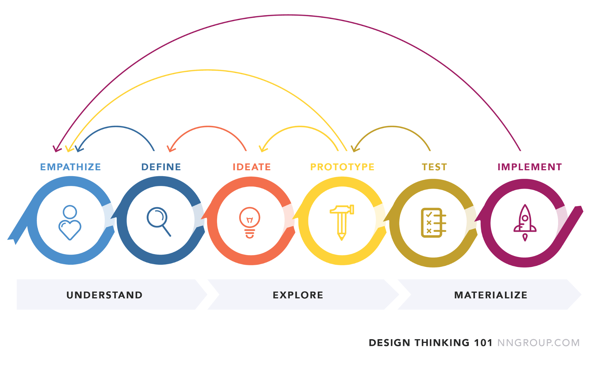

# Finch-Robot

### Development Checklist

| Completed | Task         | Description |
|:---------:| :-----------:|:------------|
|    ✅     | Familiarize  | Learn how to: <ul><li>Connect to the robot</li><li>Interpret what built-in sensors detect</li><li>Program basics in SNAP!</li><li>Setup local developing environment to code in Java</li></ul>|
|    ✅     | 3D Design    |             |
|    ✅     | Develop Code |             |

---

<details>
<summary><strong>Inspiration for the Project</strong></summary>

I wanted people to test their **luck**!
</details>

---

### Design Cycle


-**First:**: I made a prototype, it was too small and could't be assembled properly.
-**Second:** I Idieated it and made it bigger but didn't get to test it because there wasn't enough time to print it.

---

### Code to Highlight
```java
public class FinchTest {
    public static void main(String[] args) {
        for(int i = 0; i<30; i++){
            Finch myFinch = new Finch();
            while(myFinch.getDistance()>20) {
        	    myFinch.setMove("F", 10, 50);
            }
            myFinch.stop(30);
            int turn = Math.random()*180;
            if(turn>90) {
        	    myFinch.setTurn("L", turn, 50);
        
            }else {
        	    myFinch.setTurn("R", turn+90, 50);
            }
        }
        myFinch.stop();
        myFinch.quit();
    }
}
```

---


- **Motivation:** I wanted to create a fun experience where people could test their luck and get excited by the outcome.
- **Why I Built It:** The idea was to give people a rush of dopamine when they scored high — which would make others curious and want to try as well.
- **What makes it stand out:** Unlike other games mine is based entirely on luck, making it unpredictable and exciting.
